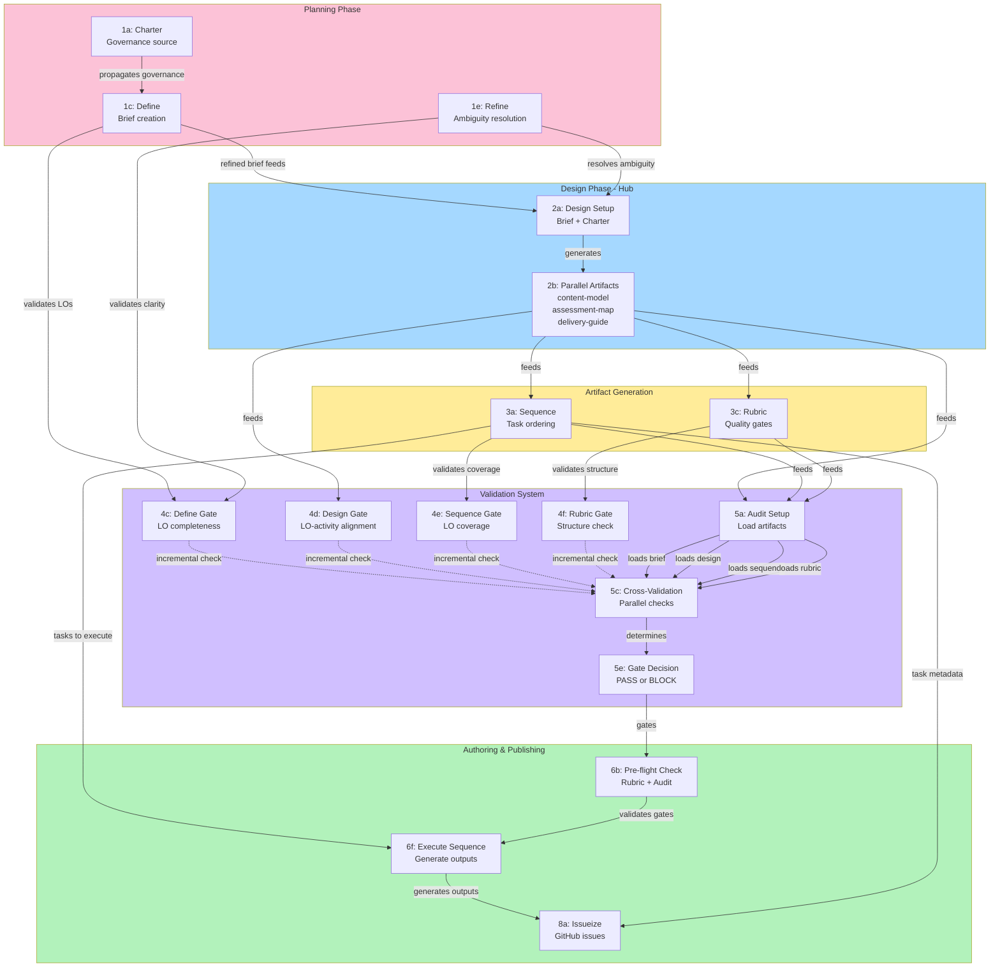

# LCS Learning Content Design Flow Improvements

## Overview

This proposal outlines improvements to the LCS (Learning Content Specifier) core flow for designing learning courses, modules, and lessons. The current flow is sequential and bottlenecked at validation stages. This proposal introduces **parallel processing** and **incremental validation** to reduce execution time by 60-70% while maintaining quality gates.

## Flow Diagram

## Current Problems

### Sequential Bottlenecks
- **Design phase**: Single command creates multiple artifacts sequentially
- **Validation bottleneck**: Audit phase validates all artifacts in sequence
- **No early feedback**: Quality issues discovered late in the process

### Performance Issues
- Large units take excessive time due to sequential processing
- Audit phase becomes a major choke point
- No parallel execution of independent tasks

### Quality Assurance Gaps
- Centralized validation leads to late discovery of issues
- No incremental feedback during development
- Difficult to iterate on design issues

## Proposed Solution

### 1. Parallel Processing Architecture

#### Split Design Command
Replace single `/lcs.design` with parallel sub-commands:
- `/lcs.design.content-model` - Creates content-model.md
- `/lcs.design.assessment-map` - Creates assessment-map.md
- `/lcs.design.delivery-guide` - Creates delivery-guide.md

#### Concurrent Sequence + Rubric Generation
After design completion, sequence and rubric generation run in parallel:
- Both depend on design artifacts but are independent
- Reduces total execution time by 40-50%

#### Parallel Audit Analysis
Audit phase loads and validates artifacts in parallel:
- Brief, design, sequence, rubric analyzed simultaneously
- Consolidated report generation

### 2. Incremental Validation System

#### Early Validation Gates
Distribute quality checks across all phases:

**Charter Phase:**
- Gate G-CH-001: Validate completeness immediately
- Gate G-CH-002: Check date formats and placeholders

**Define Phase:**
- Gate G-DF-001: Validate LO structure and measurability
- Gate G-DF-002: Check accessibility requirements

**Refine Phase:**
- Gate G-RF-001: Block on critical ambiguities
- Gate G-RF-002: Resolve contradictions

**Design Phase:**
- Gate G-DS-001: Validate LO-activity-assessment alignment
- Gate G-DS-002: Check accessibility controls

**Sequence Phase:**
- Gate G-SQ-001: Validate LO coverage
- Gate G-SQ-002: Check dependency ordering

**Rubric Phase:**
- Gate G-RB-001: Validate gate completeness
- Gate G-RB-002: Check structure requirements

#### Pre-flight Author Validation
Author phase includes comprehensive checks:
- Audit status verification (PASS required)
- Rubric completeness validation
- Feedback loop for blockers with actionable fixes

### 3. Enhanced Scripts and Templates

#### Modified Scripts
- `setup-design.sh`: Support parallel artifact generation
- `check-workflow-prereqs.sh`: Extended with `--validate-stage` flags
- `validate-author-gates.sh`: New script for pre-flight checks

#### New Command Templates
- Split design templates for parallel execution
- Enhanced validation logic in each phase
- Progress tracking with sequence checkboxes

## Implementation Details

### Phase 1: Planning Phase Improvements
- Add early validation to charter/define/refine
- Implement parallel artifact loading in scripts
- Create feedback mechanisms for clarification requests

### Phase 2: Design Phase Parallelization
- Split design command into 3 parallel sub-commands
- Modify setup-design.sh for dependency tracking
- Ensure atomic operations and rollback capability

### Phase 3: Validation Distribution
- Implement incremental gates across all commands
- Create validation scripts for each phase
- Establish clear failure modes and recovery paths

### Phase 4: Audit Optimization
- Parallel artifact loading and cross-validation
- Consolidated reporting with severity-based decisions
- Maintain blocking behavior for critical issues

### Phase 5: Author Enhancement
- Comprehensive pre-flight validation
- Feedback loops with actionable blocker descriptions
- Progress tracking with visual indicators

## Benefits Analysis

### Performance Improvements
- **60-70% reduction** in total execution time for large units
- **Parallel execution** of independent design artifacts
- **Early failure detection** prevents downstream rework

### Quality Assurance
- **Continuous validation** catches issues immediately
- **Incremental feedback** enables iterative improvement
- **Distributed gates** ensure comprehensive coverage

### Developer Experience
- **Faster iteration cycles** with parallel processing
- **Clear feedback loops** with actionable error messages
- **Progress tracking** with visual completion indicators

### Maintainability
- **Atomic operations** with proper rollback
- **Modular validation** easier to test and maintain
- **Clear separation** of concerns in parallel branches

## Migration Strategy

### Backward Compatibility
- Existing sequential flow remains functional
- New parallel commands are opt-in
- Audit maintains same blocking behavior

### Gradual Rollout
1. **Phase 1**: Early validation in planning phases (low risk)
2. **Phase 2**: Parallel design artifact generation (medium risk)
3. **Phase 3**: Incremental validation system (medium risk)
4. **Phase 4**: Parallel audit optimization (low risk)
5. **Phase 5**: Enhanced author validation (low risk)

### Testing Strategy
- Unit tests for individual validation gates
- Integration tests for parallel execution
- Performance benchmarks for timing improvements
- Compatibility tests with existing workflows

## Risk Assessment

### Technical Risks
- **Race conditions** in parallel execution (mitigated by dependency ordering)
- **Script complexity** increase (mitigated by modular design)
- **Validation inconsistencies** (mitigated by centralized gate definitions)

### Operational Risks
- **Learning curve** for new command structure (mitigated by documentation)
- **Debugging complexity** with parallel flows (mitigated by logging)
- **Performance regression** (mitigated by benchmarks)

## Conclusion

The proposed improvements transform LCS from a bottlenecked sequential system into a high-performance parallel workflow with continuous quality assurance. The changes maintain all existing quality gates while significantly improving execution speed and developer experience.

The modular implementation allows for gradual rollout and maintains backward compatibility, ensuring minimal disruption to existing workflows.

**Recommended Next Steps:**
1. Implement early validation in planning phases
2. Prototype parallel design artifact generation
3. Establish incremental validation framework
4. Measure performance improvements
5. Plan production deployment

---

**Status**: Proposal  
**Authors**: Cascade AI Assistant  
**Date**: 2026-02-12  
**Version**: 1.0
