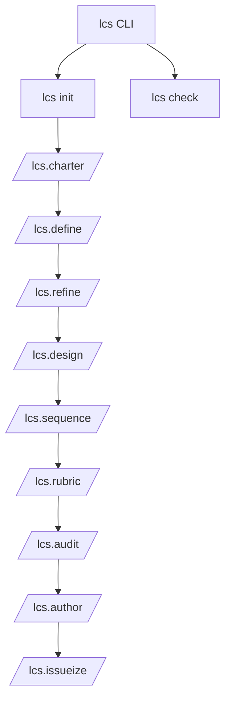

```mermaid
flowchart TD
    CLI[lcs CLI]
    Init[lcs init]
    Check[lcs check]

    Charter[/lcs.charter/]
    Define[/lcs.define/]
    Refine[/lcs.refine/]
    Design[/lcs.design/]
    Sequence[/lcs.sequence/]
    Rubric[/lcs.rubric/]
    Audit[/lcs.audit/]
    Author[/lcs.author/]
    Issueize[/lcs.issueize/]

    CLI --> Init
    CLI --> Check

    Init --> Charter
    Charter --> Define --> Refine --> Design --> Sequence --> Rubric --> Audit --> Author --> Issueize
```
