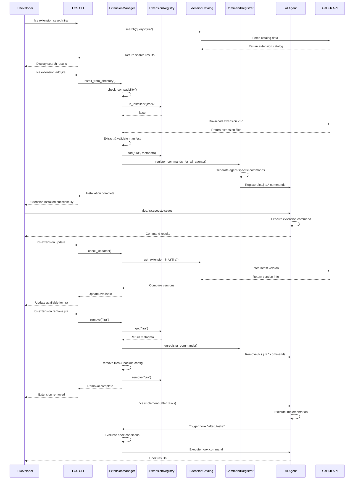

```mermaid
sequenceDiagram
    participant User as 👤 Developer
    participant CLI as LCS CLI
    participant ExtMgr as ExtensionManager
    participant ExtReg as ExtensionRegistry
    participant ExtCat as ExtensionCatalog
    participant CmdReg as CommandRegistrar
    participant Agent as AI Agent
    participant GitHub as GitHub API

    %% Extension Discovery & Search
    User->>CLI: lcs extension search jira
    CLI->>ExtCat: search(query="jira")
    ExtCat->>GitHub: Fetch catalog data
    GitHub-->>ExtCat: Return extension catalog
    ExtCat-->>CLI: Return search results
    CLI-->>User: Display search results

    %% Extension Installation
    User->>CLI: lcs extension add jira
    CLI->>ExtMgr: install_from_directory()
    ExtMgr->>ExtMgr: check_compatibility()
    ExtMgr->>ExtReg: is_installed("jira")?
    ExtReg-->>ExtMgr: false
    ExtMgr->>GitHub: Download extension ZIP
    GitHub-->>ExtMgr: Return extension files
    ExtMgr->>ExtMgr: Extract & validate manifest
    ExtMgr->>ExtReg: add("jira", metadata)
    ExtMgr->>CmdReg: register_commands_for_all_agents()
    CmdReg->>CmdReg: Generate agent-specific commands
    CmdReg->>Agent: Register /lcs.jira.* commands
    ExtMgr-->>CLI: Installation complete
    CLI-->>User: Extension installed successfully

    %% Extension Usage
    User->>Agent: /lcs.jira.specstoissues
    Agent->>Agent: Execute extension command
    Agent-->>User: Command results

    %% Extension Update Check
    User->>CLI: lcs extension update
    CLI->>ExtMgr: check_updates()
    ExtMgr->>ExtCat: get_extension_info("jira")
    ExtCat->>GitHub: Fetch latest version
    GitHub-->>ExtCat: Return version info
    ExtCat-->>ExtMgr: Compare versions
    ExtMgr-->>CLI: Update available
    CLI-->>User: Update available for jira

    %% Extension Removal
    User->>CLI: lcs extension remove jira
    CLI->>ExtMgr: remove("jira")
    ExtMgr->>ExtReg: get("jira")
    ExtReg-->>ExtMgr: Return metadata
    ExtMgr->>CmdReg: unregister_commands()
    CmdReg->>Agent: Remove /lcs.jira.* commands
    ExtMgr->>ExtMgr: Remove files & backup config
    ExtMgr->>ExtReg: remove("jira")
    ExtMgr-->>CLI: Removal complete
    CLI-->>User: Extension removed

    %% Hook Execution
    User->>Agent: /lcs.implement (after tasks)
    Agent->>Agent: Execute implementation
    Agent->>ExtMgr: Trigger hook "after_tasks"
    ExtMgr->>ExtMgr: Evaluate hook conditions
    ExtMgr->>Agent: Execute hook command
    Agent-->>User: Hook results
```
