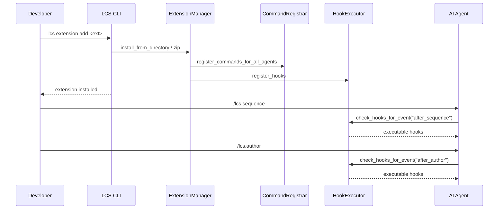

```mermaid
sequenceDiagram
    participant User as Developer
    participant CLI as LCS CLI
    participant ExtMgr as ExtensionManager
    participant CmdReg as CommandRegistrar
    participant Hook as HookExecutor
    participant Agent as AI Agent

    User->>CLI: lcs extension add <ext>
    CLI->>ExtMgr: install_from_directory / zip
    ExtMgr->>CmdReg: register_commands_for_all_agents
    ExtMgr->>Hook: register_hooks
    CLI-->>User: extension installed

    User->>Agent: /lcs.sequence
    Agent->>Hook: check_hooks_for_event("after_sequence")
    Hook-->>Agent: executable hooks

    User->>Agent: /lcs.author
    Agent->>Hook: check_hooks_for_event("after_author")
    Hook-->>Agent: executable hooks
```
