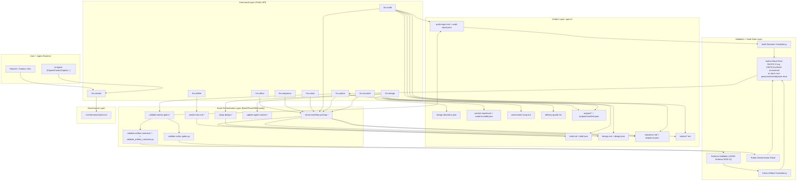
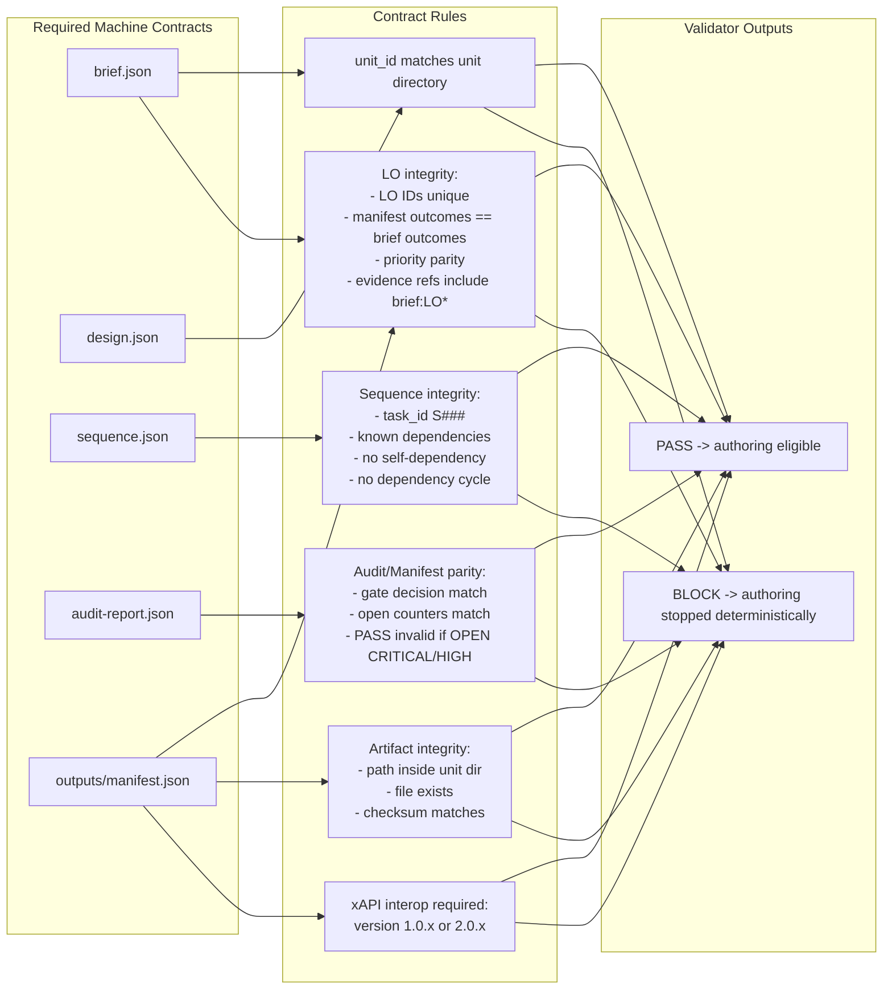
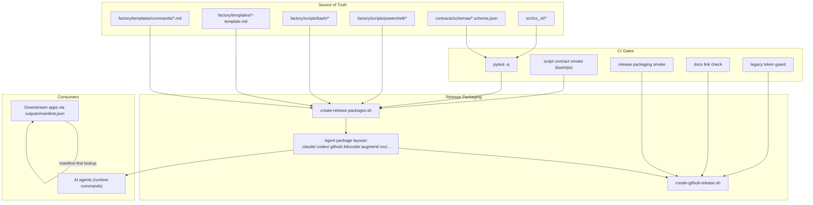

# LCS Learning Content System: Detailed Architecture Diagram

**Scope:** Greenfield learning-content system with deterministic hard gates.  
**Canonical command chain:**  
`/lcs.charter -> /lcs.define -> /lcs.refine -> /lcs.design -> /lcs.sequence -> /lcs.rubric -> /lcs.audit -> /lcs.author -> /lcs.issueize`

## 1) End-to-End Runtime Architecture

## 2) Artifact Contracts + Gate Decisions

## 3) Delivery, CI, and Packaging Topology

## Source alignment

- `docs/system/codemaps/LCS_Commands/diagram.md`
- `docs/system/codemaps/LCS_Commands/LCS_Analysis_Command_Workflow_Cross-Artifact_Consistency_Validation_System.md`
- `docs/proposals/lcs-flow-improvements/LCS-Flow-Improvements-Proposal.md`
- `docs/proposals/lcs-flow-improvements/PLAN.md`
- `docs/system/architect/lcs-output-consumer-standalone-blueprint.md`
