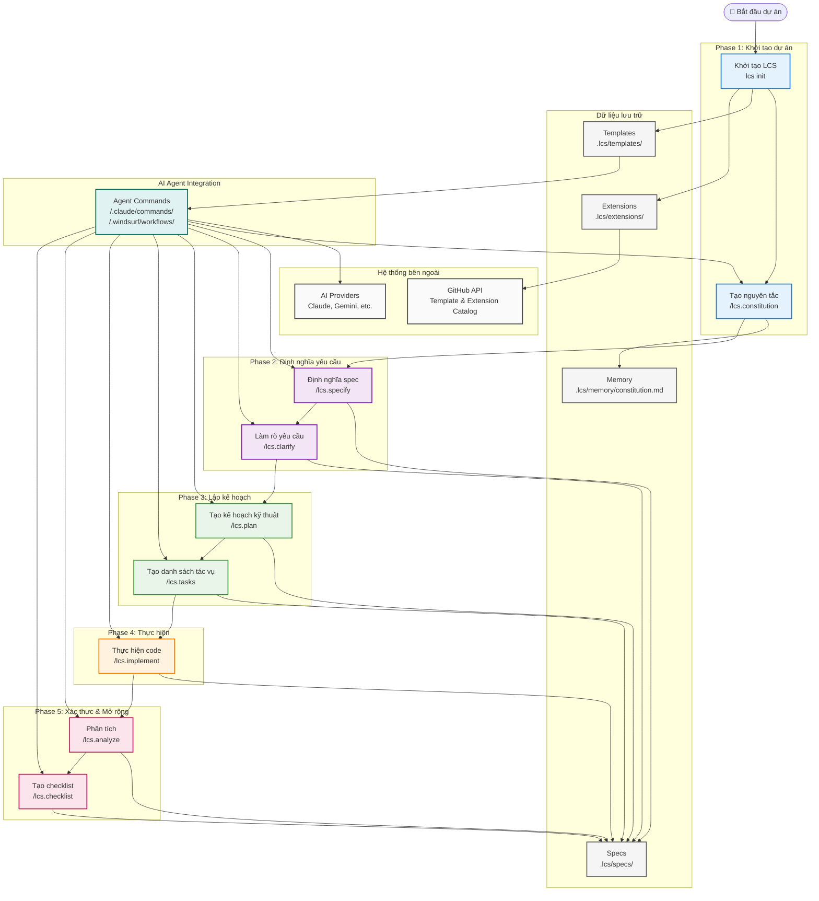

```mermaid
flowchart TD
    %% Start Point
    Start([🚀 Bắt đầu dự án])

    %% Phase 1: Project Initialization
    subgraph "Phase 1: Khởi tạo dự án"
        Init[Khởi tạo LCS<br/>lcs init]
        Constitution[Tạo nguyên tắc<br/>/lcs.constitution]
    end

    %% Phase 2: Specification
    subgraph "Phase 2: Định nghĩa yêu cầu"
        Specify[Định nghĩa spec<br/>/lcs.specify]
        Clarify[Làm rõ yêu cầu<br/>/lcs.clarify]
    end

    %% Phase 3: Planning
    subgraph "Phase 3: Lập kế hoạch"
        Plan[Tạo kế hoạch kỹ thuật<br/>/lcs.plan]
        Tasks[Tạo danh sách tác vụ<br/>/lcs.tasks]
    end

    %% Phase 4: Implementation
    subgraph "Phase 4: Thực hiện"
        Implement[Thực hiện code<br/>/lcs.implement]
    end

    %% Phase 5: Validation & Extension
    subgraph "Phase 5: Xác thực & Mở rộng"
        Analyze[Phân tích<br/>/lcs.analyze]
        Checklist[Tạo checklist<br/>/lcs.checklist]
    end

    %% Data Stores
    subgraph "Dữ liệu lưu trữ"
        Memory[Memory<br/>.lcs/memory/constitution.md]
        Specs[Specs<br/>.lcs/specs/]
        Templates[Templates<br/>.lcs/templates/]
        Extensions[Extensions<br/>.lcs/extensions/]
    end

    %% AI Agent Integration
    subgraph "AI Agent Integration"
        AgentCommands[Agent Commands<br/>/.claude/commands/<br>/.windsurf/workflows/]
    end

    %% External Systems
    subgraph "Hệ thống bên ngoài"
        GitHub[GitHub API<br/>Template & Extension Catalog]
        AIProviders[AI Providers<br/>Claude, Gemini, etc.]
    end

    %% Flow Connections
    Start --> Init
    Init --> Constitution
    Constitution --> Memory

    Constitution --> Specify
    Specify --> Specs
    Specify --> Clarify
    Clarify --> Specs

    Clarify --> Plan
    Plan --> Specs
    Plan --> Tasks
    Tasks --> Specs

    Tasks --> Implement
    Implement --> Specs

    Implement --> Analyze
    Analyze --> Specs

    Analyze --> Checklist
    Checklist --> Specs

    %% Template System Integration
    Init --> Templates
    Templates --> AgentCommands
    AgentCommands --> AIProviders

    %% Extension System
    Init --> Extensions
    Extensions --> GitHub

    %% AI Agent Commands Flow
    AgentCommands --> Constitution
    AgentCommands --> Specify
    AgentCommands --> Clarify
    AgentCommands --> Plan
    AgentCommands --> Tasks
    AgentCommands --> Implement
    AgentCommands --> Analyze
    AgentCommands --> Checklist

    %% Styling
    classDef phase1 fill:#e3f2fd,stroke:#1976d2,stroke-width:2px
    classDef phase2 fill:#f3e5f5,stroke:#7b1fa2,stroke-width:2px
    classDef phase3 fill:#e8f5e8,stroke:#388e3c,stroke-width:2px
    classDef phase4 fill:#fff3e0,stroke:#f57c00,stroke-width:2px
    classDef phase5 fill:#fce4ec,stroke:#c2185b,stroke-width:2px
    classDef dataStore fill:#f5f5f5,stroke:#616161,stroke-width:2px
    classDef aiIntegration fill:#e0f2f1,stroke:#00695c,stroke-width:2px
    classDef external fill:#fafafa,stroke:#424242,stroke-width:2px

    class Init,Constitution phase1
    class Specify,Clarify phase2
    class Plan,Tasks phase3
    class Implement phase4
    class Analyze,Checklist phase5
    class Memory,Specs,Templates,Extensions dataStore
    class AgentCommands aiIntegration
    class GitHub,AIProviders external
```
