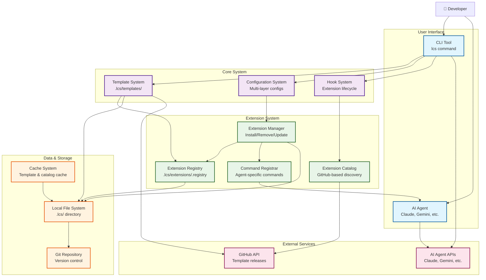

```mermaid
graph TB
    %% User Interface Layer
    subgraph "User Interface"
        CLI[CLI Tool<br/>lcs command]
        Agent[AI Agent<br/>Claude, Gemini, etc.]
    end

    %% Core System Layer
    subgraph "Core System"
        TemplateSys[Template System<br/>.lcs/templates/]
        ConfigSys[Configuration System<br/>Multi-layer configs]
        HookSys[Hook System<br/>Extension lifecycle]
    end

    %% Extension Layer
    subgraph "Extension System"
        ExtReg[Extension Registry<br/>.lcs/extensions/.registry]
        ExtMgr[Extension Manager<br/>Install/Remove/Update]
        ExtCat[Extension Catalog<br/>GitHub-based discovery]
        Commands[Command Registrar<br/>Agent-specific commands]
    end

    %% Data Layer
    subgraph "Data & Storage"
        LocalFS[Local File System<br/>.lcs/ directory]
        GitRepo[Git Repository<br/>Version control]
        Cache[Cache System<br/>Template & catalog cache]
    end

    %% External Services
    subgraph "External Services"
        GitHub[GitHub API<br/>Template releases]
        AgentAPIs[AI Agent APIs<br/>Claude, Gemini, etc.]
    end

    %% User Interactions
    User[👤 Developer] --> CLI
    User --> Agent

    %% CLI to Core System
    CLI --> TemplateSys
    CLI --> ConfigSys
    CLI --> HookSys

    %% Core to Extension System
    TemplateSys --> ExtReg
    ConfigSys --> ExtMgr
    HookSys --> ExtCat

    %% Extension System Interactions
    ExtMgr --> ExtReg
    ExtMgr --> Commands
    ExtCat --> GitHub
    Commands --> Agent

    %% Data Storage
    TemplateSys --> LocalFS
    ExtReg --> LocalFS
    ExtMgr --> LocalFS
    Cache --> LocalFS

    %% Version Control
    LocalFS --> GitRepo

    %% External Dependencies
    TemplateSys --> GitHub
    CLI --> AgentAPIs
    Agent --> AgentAPIs

    %% Styling
    classDef userInterface fill:#e1f5fe,stroke:#01579b,stroke-width:2px
    classDef coreSystem fill:#f3e5f5,stroke:#4a148c,stroke-width:2px
    classDef extensionSystem fill:#e8f5e8,stroke:#1b5e20,stroke-width:2px
    classDef dataLayer fill:#fff3e0,stroke:#e65100,stroke-width:2px
    classDef externalServices fill:#fce4ec,stroke:#880e4f,stroke-width:2px

    class CLI,Agent userInterface
    class TemplateSys,ConfigSys,HookSys coreSystem
    class ExtReg,ExtMgr,ExtCat,Commands extensionSystem
    class LocalFS,GitRepo,Cache dataLayer
    class GitHub,AgentAPIs externalServices
```
