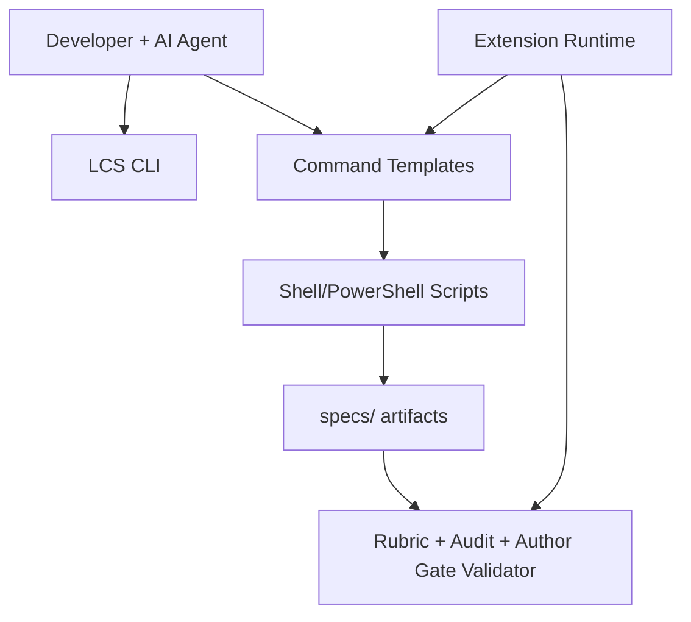

> Detailed learning-content architecture: `docs/system/architect/lcs-learning-content-system-detailed-diagram.md`

```mermaid
graph TB
    User[Developer + AI Agent]
    CLI[LCS CLI]
    Cmd[Command Templates]
    Script[Shell/PowerShell Scripts]
    Artifacts[specs/<unit> artifacts]
    Gates[Rubric + Audit + Author Gate Validator]
    Extensions[Extension Runtime]

    User --> CLI
    User --> Cmd
    Cmd --> Script
    Script --> Artifacts
    Artifacts --> Gates
    Extensions --> Cmd
    Extensions --> Gates
```
