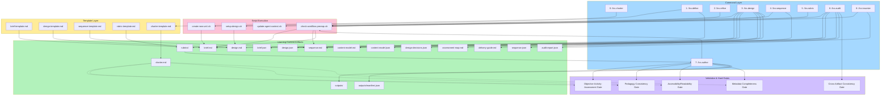

```mermaid
graph TB
    subgraph Commands["Command Layer"]
        c0["0: /lcs.charter"]
        c1["1: /lcs.define"]
        c2["2: /lcs.refine"]
        c3["3: /lcs.design"]
        c4["4: /lcs.sequence"]
        c5["5: /lcs.rubric"]
        c6["6: /lcs.audit"]
        c7["7: /lcs.author"]
        c8["8: /lcs.issueize"]
    end

    subgraph Scripts["Script Execution"]
        s1["create-new-unit.sh"]
        s2["setup-design.sh"]
        s3["check-workflow-prereqs.sh"]
        s4["update-agent-context.sh"]
    end

    subgraph Artifacts["Learning Content Artifacts"]
        brief["brief.md"]
        briefj["brief.json"]
        design["design.md"]
        designj["design.json"]
        seq["sequence.md"]
        seqj["sequence.json"]
        cmodel["content-model.md"]
        cmodelj["content-model.json"]
        decisions["design-decisions.json"]
        amap["assessment-map.md"]
        dguide["delivery-guide.md"]
        rubrics["rubrics/"]
        outputs["outputs/"]
        manifest["outputs/manifest.json"]
        auditj["audit-report.json"]
        charter["charter.md"]
    end

    subgraph Templates["Template Layer"]
        t1["brief-template.md"]
        t2["design-template.md"]
        t3["sequence-template.md"]
        t4["rubric-template.md"]
        t5["charter-template.md"]
    end

    subgraph Validation["Validation & Hard Gates"]
        g1["Objective-Activity-Assessment Gate"]
        g2["Pedagogy Consistency Gate"]
        g3["Accessibility/Readability Gate"]
        g4["Metadata Completeness Gate"]
        g5["Cross-Artifact Consistency Gate"]
    end

    c0 --> t5 --> charter

    c1 --> s1 --> brief
    c1 --> briefj
    t1 --> brief

    c2 --> s3 --> brief

    c3 --> s2 --> design
    c3 --> designj
    c3 --> cmodel
    c3 --> cmodelj
    c3 --> decisions
    c3 --> amap
    c3 --> dguide
    c3 --> s4
    t2 --> design

    c4 --> s3 --> seq
    c4 --> seqj
    t3 --> seq

    c5 --> s3 --> rubrics
    t4 --> rubrics

    c6 --> s3
    c6 --> brief
    c6 --> design
    c6 --> seq
    c6 --> auditj
    c6 --> g5

    charter -.-> g1
    charter -.-> g2
    charter -.-> g3
    charter -.-> g4

    c7 --> s3
    rubrics --> c7
    c7 --> g1
    c7 --> g2
    c7 --> g3
    c7 --> g4
    c7 --> outputs
    c7 --> manifest

    c8 --> s3
    c8 --> seq

    style Commands fill:#a5d8ff
    style Scripts fill:#fcc2d7
    style Artifacts fill:#b2f2bb
    style Templates fill:#ffec99
    style Validation fill:#d0bfff
```
