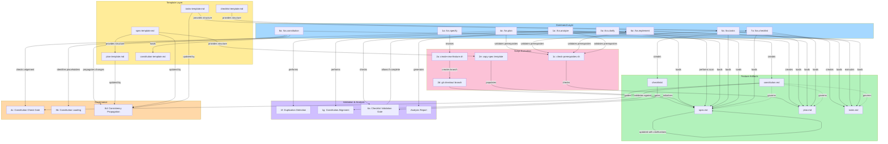

```mermaid
graph TB
    subgraph Commands["Command Layer"]
        1a["1a: /lcs.specify"]
        3a["3a: /lcs.clarify"]
        4a["4a: /lcs.plan"]
        5a["5a: /lcs.tasks"]
        6a["6a: /lcs.implement"]
        1a_analyze["1a: /lcs.analyze"]
        7a["7a: /lcs.checklist"]
        8a["8a: /lcs.constitution"]
    end

    subgraph Scripts["Script Execution"]
        2a["2a: create-new-feature.sh"]
        1c["1c: check-prerequisites.sh"]
        2d["2d: git checkout branch"]
        2e["2e: copy spec template"]
    end

    subgraph Artifacts["Feature Artifacts"]
        spec["spec.md"]
        plan["plan.md"]
        tasks["tasks.md"]
        checklists["checklists/"]
        constitution["constitution.md"]
    end

    subgraph Templates["Template Layer"]
        spec_tpl["spec-template.md"]
        plan_tpl["plan-template.md"]
        tasks_tpl["tasks-template.md"]
        checklist_tpl["checklist-template.md"]
        const_tpl["constitution-template.md"]
    end

    subgraph Validation["Validation & Analysis"]
        1f["1f: Duplication Detection"]
        1g["1g: Constitution Alignment"]
        6a_gate["6a: Checklist Validation Gate"]
        analysis_report["Analysis Report"]
    end

    subgraph Governance["Governance"]
        4c["4c: Constitution Check Gate"]
        8b["8b: Constitution Loading"]
        8d["8d: Consistency Propagation"]
    end

    %% Specification flow
    1a -->|invokes| 2a
    2a -->|creates branch| 2d
    2d -->|initializes| spec
    spec_tpl -->|provides structure| 2e
    2e -->|populates| spec

    %% Clarification flow
    3a -->|loads| spec
    3a -->|performs scan| spec
    spec -->|updated with clarifications| spec

    %% Planning flow
    4a -->|validates prerequisites| 1c
    1c -->|checks| plan
    4a -->|loads| spec
    spec_tpl -->|provides structure| plan_tpl
    4a -->|checks alignment| 4c
    constitution -->|guides| 4c
    4a -->|creates| plan

    %% Task generation flow
    5a -->|validates prerequisites| 1c
    5a -->|loads| spec
    5a -->|loads| plan
    tasks_tpl -->|provides structure| 5a
    5a -->|creates| tasks

    %% Implementation flow
    6a -->|validates prerequisites| 1c
    6a -->|checks| 6a_gate
    checklists -->|gates| 6a_gate
    6a_gate -->|allows if complete| 6a
    6a -->|loads| tasks
    6a -->|executes| tasks

    %% Analysis flow
    1a_analyze -->|validates prerequisites| 1c
    1a_analyze -->|loads| spec
    1a_analyze -->|loads| plan
    1a_analyze -->|loads| tasks
    1a_analyze -->|performs| 1f
    1a_analyze -->|performs| 1g
    constitution -->|validates against| 1g
    1a_analyze -->|generates| analysis_report

    %% Checklist flow
    7a -->|loads| spec
    7a -->|loads| plan
    checklist_tpl -->|provides structure| 7a
    7a -->|creates| checklists

    %% Constitution flow
    8a -->|loads| const_tpl
    8a -->|identifies placeholders| 8b
    8a -->|creates| constitution
    8a -->|propagates changes| 8d
    plan_tpl -->|updated by| 8d
    spec_tpl -->|updated by| 8d
    tasks_tpl -->|updated by| 8d

    %% Cross-system connections
    constitution -.->|governs| spec
    constitution -.->|governs| plan
    constitution -.->|governs| tasks

    style Commands fill:#a5d8ff
    style Scripts fill:#fcc2d7
    style Artifacts fill:#b2f2bb
    style Templates fill:#ffec99
    style Validation fill:#d0bfff
    style Governance fill:#ffd8a8
```